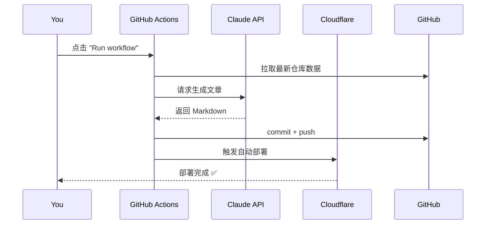

# GitHub Blog

一个由 **GitHub 数据 + AI** 自动驱动的个人博客网站。基于 [Astro](https://astro.build) 7 + [shadcn/ui](https://ui.shadcn.com) 构建，部署在 **Cloudflare Pages**（免费）。

## 特性

- 📝 **AI 自动写文章**：根据 GitHub 仓库、Star、事件等数据，调用 Claude API 自动生成博客
- 📌 **精选项目**：自动同步 GitHub Pinned 仓库
- 🔍 **项目排序**：按 Stars / 最近更新排序
- 🌙 **深色/浅色主题**：shadcn 主题系统，跟随系统偏好
- 📡 **RSS Feed**：支持订阅
- 🚀 **免费部署**：Cloudflare Pages，全球 CDN

## 技术栈

| 层 | 选型 |
|---|------|
| **框架** | [Astro 7](https://astro.build)（SSG） |
| **UI 组件** | [shadcn/ui](https://ui.shadcn.com) + React Islands |
| **样式** | Tailwind CSS 4 |
| **交互** | React 19 |
| **部署** | Cloudflare Pages |
| **CI/CD** | GitHub Actions |
| **内容生成** | Claude API（Anthropic） |
| **数据源** | GitHub REST API + GraphQL API |

## 快速开始

```bash
# 安装依赖
pnpm install

# 本地开发
pnpm dev

# 构建
pnpm build
```

### 前置要求

- **Node.js >= 22.12.0**（Astro 7 要求，推荐用 nvm 管理）
- **pnpm**（推荐 v10）

## 项目结构

```
github-blog/
├── .github/workflows/         # GitHub Actions 工作流
├── scripts/
│   ├── fetch-github.js        # 从 GitHub 拉取仓库、Pinned、事件数据
│   ├── generate-posts.js      # 调用 Claude API → 生成博客 Markdown
│   └── generate-projects.js   # 根据 GitHub 数据生成 projects.json
├── src/
│   ├── components/
│   │   ├── ui/                # shadcn 组件（Button, Card, etc.）
│   │   ├── Header.astro       # 导航栏
│   │   ├── Footer.astro       # 页脚
│   │   ├── ThemeToggle.tsx    # 深色/浅色切换
│   │   ├── BlogCard.astro     # 博客卡片
│   │   ├── ProjectsSection.astro   # 项目展示（静态）
│   │   └── SortableProjectList.tsx # 项目排序（客户端交互）
│   ├── content/
│   │   └── blog/              # 博客文章（Markdown）
│   ├── content.config.ts      # Content Collections 配置
│   ├── layouts/               # 页面布局
│   ├── pages/                 # 路由页面
│   └── styles/                # 全局样式
├── src/data/
│   └── projects.json          # 项目数据（由脚本生成）
├── docs/plan.md               # 架构文档
├── LICENSE
└── README.md
```

## 数据生成

博客内容通过脚本生成，建议按以下顺序执行：

```bash
# 1. 拉取 GitHub 数据（仓库、Pinned、语言统计）
pnpm fetch-data

# 2. 生成博客文章（需要 ANTHROPIC_API_KEY）
ANTHROPIC_API_KEY=sk-ant-xxx pnpm generate-posts

# 3. 生成项目数据（基于 GitHub 数据 + Pinned 标记）
pnpm generate-projects

# 或者一键执行：
ANTHROPIC_API_KEY=sk-ant-xxx pnpm generate
```

## 部署到 Cloudflare Pages

### 第一步：创建 Cloudflare Pages 项目

1. 登录 [Cloudflare Dashboard](https://dash.cloudflare.com/)
2. 进入 **Workers & Pages** → **Pages** → **创建项目**
3. 选择 **连接到 Git**（连接到你的 GitHub 仓库）
4. 选择 `github-blog` 仓库
5. 框架预设选择 **Astro**
6. 构建配置保留默认（`pnpm build`，输出目录 `dist/`）
7. 点击 **保存并部署**

> ⚠️ 首次部署前，建议先手动跑一次 `pnpm build` 确认通过。

### 第二步：获取 Cloudflare API Token

1. Cloudflare Dashboard → **我的个人资料** → **API 令牌**
2. 创建令牌 → 选择 **Cloudflare Pages** 模板
3. 权限：`Cloudflare Pages:Edit`
4. 限制到 `github-blog` 项目（可选）
5. 复制生成的令牌

### 第三步：配置 GitHub Secrets

在 GitHub 仓库的 **Settings → Secrets and variables → Actions** 中添加：

| Secret | 说明 | 必需 |
|--------|------|:----:|
| `ANTHROPIC_API_KEY` | Claude API 密钥，用于生成博客文章 | ✅ |
| `GITHUB_TOKEN` | 自动可用，无需手动添加。用于获取 Pinned 仓库数据 | — |
| `CLOUDFLARE_API_TOKEN` | Cloudflare API 令牌（上一步获取） | ✅ |

> `GITHUB_TOKEN` 是 GitHub Actions 自动注入的，你不需要手动创建。如果要在本地测试 Pinned 抓取，可以在本地环境变量中设置自己的 GitHub Token（40 位 fine-grained PAT）。

### 第四步：触发工作流

1. 前往 GitHub 仓库 → **Actions** 页
2. 点击 **Generate Blog Content & Deploy**
3. 点击 **Run workflow**
4. 选择文章类型和篇数
5. 点击 **Run**

工作流会：
1. 拉取最新 GitHub 数据
2. 调用 Claude API 生成博客文章
3. 生成项目数据
4. 推送到仓库
5. 触发 Cloudflare Pages 自动构建部署

## 更新博客

### 方式一：手动触发（推荐）



1. 打开 GitHub 仓库的 **Actions** 页
2. 在左侧选择 **Generate Blog Content & Deploy**
3. 点击右上角 **Run workflow**
4. 选择文章类型（auto / weekly / project / tech-stack）
5. 选择生成篇数（1-3）
6. 点击 **Run workflow**

### 方式二：本地生成 + 推送

```bash
# 1. 拉取最新 GitHub 数据
pnpm fetch-data

# 2. 查看当前数据状态（确认 Pinned 等）
cat scripts/data/github-stats.json | python3 -m json.tool

# 3. 生成项目数据
pnpm generate-projects

# 4. 可选：本地构建验证
pnpm build

# 5. 提交推送
git add src/data/
git commit -m "chore: update projects data"
git push
```

### Pinned 仓库更新

精选项目自动同步你的 GitHub Pinned 仓库：

- **GraphQL 模式**（有 GITHUB_TOKEN）：通过 GitHub GraphQL API 精确获取
- **HTML 降级模式**（无 Token）：解析 GitHub 个人主页 HTML

修改 GitHub 上的 Pinned 后，运行 `pnpm fetch-data && pnpm generate-projects` 即可更新。

## 自定义域名（可选）

1. Cloudflare Dashboard → **Pages** → `github-blog`
2. **自定义域** → **设置自定义域**
3. 输入你的域名（需要 DNS 托管在 Cloudflare）
4. Cloudflare 会自动添加 DNS 记录

> 将 DNS 托管到 Cloudflare 后，还能获得 DDoS 防护、CDN 加速等能力。

## 本地开发 VSCode 配置

如果你在 VSCode 中开发：

```jsonc
// .vscode/settings.json
{
  // 关掉 VSCode 的 GitHub 认证注入（终端 push 会每次询问）
  "github.gitAuthentication": false
}
```

然后用 git credential 手动管理：

```bash
# 清除缓存（如之前存过）
git credential-osxkeychain erase <<EOF
host=github.com
protocol=https
EOF

# 可选：禁用 git 凭据缓存，每次 push 都会要求输入
git config --local credential.helper ""
```

## 许可证

MIT
