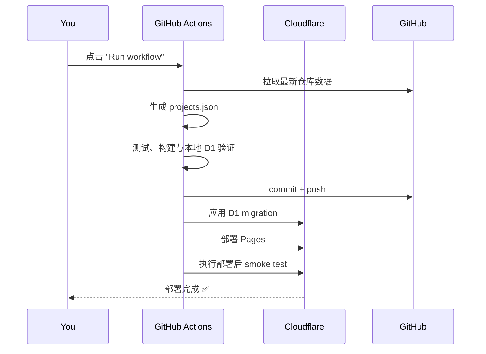

# GitHub Blog

一个由 **GitHub 数据驱动**的个人技术博客。项目数据自动同步，文章以 Markdown 维护；基于 [Astro](https://astro.build) 7 + [shadcn/ui](https://ui.shadcn.com) 构建，部署在 **Cloudflare Pages**。

## 特性

- 📝 **Markdown 博客**：人类或协作 Agent 按统一规则维护文章
- 📌 **精选项目**：自动同步 GitHub Pinned 仓库
- 🔍 **项目排序**：按 Stars / 最近更新排序
- 🌙 **深色/浅色主题**：shadcn 主题系统，跟随系统偏好
- 📡 **RSS Feed**：支持订阅
- 📊 **访问统计**：Pages Functions + D1，支持文章 PV / UV 与站长后台
- 🚀 **免费部署**：Cloudflare Pages，全球 CDN

## 技术栈

| 层 | 选型 |
|---|------|
| **框架** | [Astro 7](https://astro.build)（SSG） |
| **UI 组件** | [shadcn/ui](https://ui.shadcn.com) + React Islands |
| **样式** | Tailwind CSS 4 |
| **交互** | React 19 |
| **部署** | Cloudflare Pages |
| **CI/CD** | GitHub Actions |
| **内容管理** | Astro Content Collections + Markdown |
| **数据源** | GitHub REST API + GraphQL API |
| **动态接口** | Cloudflare Pages Functions |
| **访问统计** | Cloudflare D1 |

## 快速开始

前置要求：

- Node.js `>=22.12.0`（推荐使用 nvm）
- pnpm 10

```bash
# 切换 Node.js 版本
nvm use 22

# 安装依赖
pnpm install

# 启动本地开发服务器
pnpm dev
```

浏览器打开：

- 首页：`http://localhost:4321/`
- 博客：`http://localhost:4321/blog`
- 项目：`http://localhost:4321/projects`

本地查看已有静态内容不需要重新抓取 GitHub 或生成文章。`pnpm dev` 不会模拟
Pages Functions；需要联调访问统计时，请使用下方“访问统计”中的 Wrangler 流程。
提交前可执行 `pnpm verify` 完成单元测试、生产构建和本地 D1 端到端验证。

## 项目结构

```
github-blog/
├── .github/workflows/         # GitHub Actions 工作流
├── functions/                 # Cloudflare Pages Functions
│   ├── _shared/               # 统计、HTTP 与后台认证共享逻辑
│   └── api/                   # 公开统计和后台 API
├── migrations/                # D1 数据库迁移
├── scripts/
│   ├── fetch-github.js        # 从 GitHub 拉取仓库、Pinned、事件数据
│   ├── generate-projects.js   # 根据 GitHub 数据生成 projects.json
│   ├── dev-analytics.js       # 一键启动本地 Pages Functions + D1
│   └── test-analytics-e2e.js  # 隔离的统计端到端测试
├── src/
│   ├── components/
│   │   ├── ui/                # shadcn 组件（Button, Card, etc.）
│   │   ├── Header.astro       # 导航栏
│   │   ├── Footer.astro       # 页脚
│   │   ├── ThemeToggle.tsx    # 深色/浅色切换
│   │   ├── BlogCard.astro     # 博客卡片
│   │   ├── ProjectsSection.astro   # 项目展示（静态）
│   │   └── SortableProjectList.tsx # 项目排序（客户端交互）
│   ├── content/
│   │   └── blog/              # 博客文章（Markdown）
│   ├── content.config.ts      # Content Collections 配置
│   ├── layouts/               # 页面布局
│   ├── pages/                 # 静态路由与 /admin/analytics
│   └── styles/                # 全局样式
├── src/data/
│   └── projects.json          # 项目数据（由脚本生成）
├── docs/plan.md               # 架构文档
├── docs/analytics-plan.md     # D1 访问统计方案
├── docs/analytics-operations.md # 测试和发布操作手册
├── wrangler.local.example.toml # 本地 D1 配置
├── LICENSE
└── README.md
```

## 数据生成

| 命令 | 作用 | 是否访问外部 API | 主要输出 |
|------|------|------------------|----------|
| `pnpm fetch-data` | 抓取 GitHub 用户、仓库、Pinned 和事件数据 | GitHub API | `scripts/data/github-stats.json` |
| `pnpm generate-projects` | 根据已有 GitHub 数据生成项目页数据 | 否 | `src/data/projects.json` |
| `pnpm sync-projects` | 依次执行 `fetch-data` 和 `generate-projects` | GitHub API | 上述两个 JSON 文件 |

注意：

- `generate-projects` 读取已有的 `scripts/data/github-stats.json`，不会自动刷新 GitHub 数据。
- `scripts/data/` 是被 Git 忽略的中间数据；需要提交的是 `src/data/projects.json`。
- 博客文章由人类或协作 Agent 按 `AGENTS.md` 中的规则写入 `src/content/blog/`。

只同步新增仓库或 Pinned：

```bash
pnpm sync-projects
```

## 访问统计

访问统计只记录允许的站内 pathname、浏览器生成的匿名 UUID、Unix 分钟桶和
UTC 写入时间；不保存 IP、User-Agent、完整 referrer 或登录身份。同一访客对
同一页面一分钟内只计一次 PV。

### 本地测试

```bash
nvm use 22

# 单元测试 + 构建 + 隔离的本地 D1 端到端测试
pnpm verify

# 需要浏览器手动查看时
pnpm dev:analytics
```

`pnpm verify` 会自动创建临时 D1、执行 migration、启动 Pages Functions、验证
公开和后台 API，并在结束后清理，不需要 Cloudflare 账号或真实 database ID。
`pnpm dev:analytics` 默认使用 `test-password` 登录本地后台，数据保存在
`.wrangler/`。完整步骤见
[`docs/analytics-operations.md`](docs/analytics-operations.md)。

## 部署到 Cloudflare Pages

### 第一步：创建 Cloudflare Pages 项目

1. 登录 [Cloudflare Dashboard](https://dash.cloudflare.com/)
2. 进入 **Workers & Pages** → **Pages** → **创建项目**
3. 选择 **连接到 Git**（连接到你的 GitHub 仓库）
4. 选择 `github-blog` 仓库
5. 框架预设选择 **Astro**
6. 构建配置保留默认（`pnpm build`，输出目录 `dist/`）
7. 点击 **保存并部署**
8. 进入 **Settings → Builds → Branch control**，关闭自动生产分支部署，并将
   Preview branch 设置为 `None`

> ⚠️ 首次部署前，建议先手动跑一次 `pnpm verify` 确认通过。
>
> 本项目以 GitHub Actions + Wrangler 作为唯一发布入口。必须关闭 Cloudflare
> Git 自动部署，否则同步数据产生的 push 会绕过测试、migration 和 smoke 门禁。

### 访问统计生产配置

本项目不提交 `wrangler.toml`，生产 binding 以 Cloudflare Pages Dashboard
为唯一来源。在对应 Pages 项目的 **Settings → Bindings / Variables** 中配置：

| 名称 | 类型 | 说明 |
|------|------|------|
| `DB` | D1 database binding | 绑定 `github-blog` 数据库 |
| `ADMIN_PASSWORD` | 加密变量 | 后台登录密码 |
| `ADMIN_SESSION_SECRET` | 加密变量 | 至少 32 个随机字符的会话签名密钥 |

发布工作流会在部署代码前自动执行：

```bash
pnpm dlx wrangler@4.114.0 d1 migrations apply github-blog --remote
```

该步骤使用独立的 `CLOUDFLARE_D1_API_TOKEN`；migration 失败时不会继续部署。
需要人工执行时也可以使用同一命令。

还必须在 Cloudflare 中为 `POST /api/analytics` 配置速率限制，并为
`POST /api/admin/login` 配置更严格的独立规则。服务端一分钟去重不能替代
边缘速率限制。

### 第二步：获取 Cloudflare API Token

1. Cloudflare Dashboard → **我的个人资料** → **API 令牌**
2. 创建令牌 → 选择 **Cloudflare Pages** 模板
3. 权限：`Cloudflare Pages:Edit`
4. 限制到 `github-blog` 项目（可选）
5. 复制生成的令牌

### 第三步：配置 GitHub Secrets

在 GitHub 仓库的 **Settings → Secrets and variables → Actions** 中添加：

| Secret | 说明 | 必需 |
|--------|------|:----:|
| `GITHUB_TOKEN` | 自动可用，无需手动添加。用于获取 Pinned 仓库数据 | — |
| `CLOUDFLARE_API_TOKEN` | Cloudflare API 令牌（上一步获取） | ✅ |
| `CLOUDFLARE_ACCOUNT_ID` | Cloudflare 账号 ID | ✅ |
| `CLOUDFLARE_D1_API_TOKEN` | 独立的 D1 migration 令牌，授予 D1 Edit | ✅ |

> `GITHUB_TOKEN` 是 GitHub Actions 自动注入的，你不需要手动创建。如果要在本地测试 Pinned 抓取，可以在本地环境变量中设置自己的 GitHub Token（40 位 fine-grained PAT）。

仓库还需要建立名为 `production` 的 GitHub Environment。需要人工发布审批时，
在该 Environment 中配置 required reviewers。

### 第四步：触发工作流

1. 前往 GitHub 仓库 → **Actions** 页
2. 点击 **Sync GitHub Projects & Deploy**
3. 点击 **Run workflow**
4. 点击 **Run**

工作流会：
1. 拉取最新 GitHub 数据
2. 生成项目数据
3. 运行测试与构建后推送生成数据
4. 等待 production environment 审批
5. 运行完整本地 D1 端到端测试
6. 应用生产 D1 migration
7. 部署 Cloudflare Pages
8. 对部署 URL 执行 smoke test

## 更新博客

### 方式一：手动触发（推荐）


```mermaid
sequenceDiagram
    participant You
    participant GitHub Actions
    participant Cloudflare

    You->>GitHub Actions: 点击 "Run workflow"
    GitHub Actions->>GitHub: 拉取最新仓库数据
    GitHub Actions->>GitHub Actions: 生成 projects.json
    GitHub Actions->>GitHub Actions: 测试、构建与本地 D1 验证
    GitHub Actions->>GitHub: commit + push
    GitHub Actions->>Cloudflare: 应用 D1 migration
    GitHub Actions->>Cloudflare: 部署 Pages
    GitHub Actions->>Cloudflare: 执行部署后 smoke test
    Cloudflare-->>You: 部署完成 ✅
```

1. 打开 GitHub 仓库的 **Actions** 页
2. 在左侧选择 **Sync GitHub Projects & Deploy**
3. 点击右上角 **Run workflow**
4. 点击 **Run workflow**

### 方式二：本地生成 + 推送

```bash
# 1. 拉取最新 GitHub 数据并生成项目数据
pnpm sync-projects

# 2. 查看当前数据状态（确认 Pinned 等）
cat scripts/data/github-stats.json | python3 -m json.tool

# 3. 完整验证
pnpm verify

# 4. 提交推送
git add src/data/
git commit -m "chore: update projects data"
git push
```

### Pinned 仓库更新

精选项目自动同步你的 GitHub Pinned 仓库：

- **GraphQL 模式**（有 GITHUB_TOKEN）：通过 GitHub GraphQL API 精确获取
- **HTML 降级模式**（无 Token）：解析 GitHub 个人主页 HTML

新增仓库或修改 GitHub Pinned 后，运行 `pnpm sync-projects` 即可更新。

## 自定义域名（可选）

1. Cloudflare Dashboard → **Pages** → `github-blog`
2. **自定义域** → **设置自定义域**
3. 输入你的域名（需要 DNS 托管在 Cloudflare）
4. Cloudflare 会自动添加 DNS 记录

> 将 DNS 托管到 Cloudflare 后，还能获得 DDoS 防护、CDN 加速等能力。

## 本地开发 VSCode 配置

如果你在 VSCode 中开发：

```jsonc
// .vscode/settings.json
{
  // 关掉 VSCode 的 GitHub 认证注入（终端 push 会每次询问）
  "github.gitAuthentication": false
}
```

然后用 git credential 手动管理：

```bash
# 清除缓存（如之前存过）
git credential-osxkeychain erase <<EOF
host=github.com
protocol=https
EOF

# 可选：禁用 git 凭据缓存，每次 push 都会要求输入
git config --local credential.helper ""
```

## 许可证

MIT
