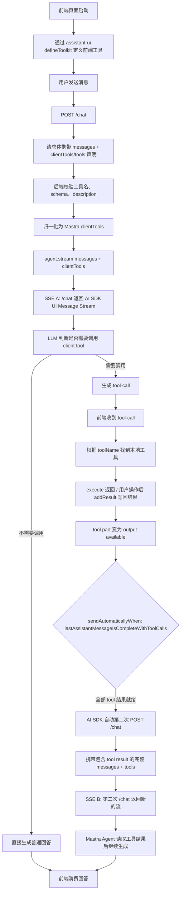
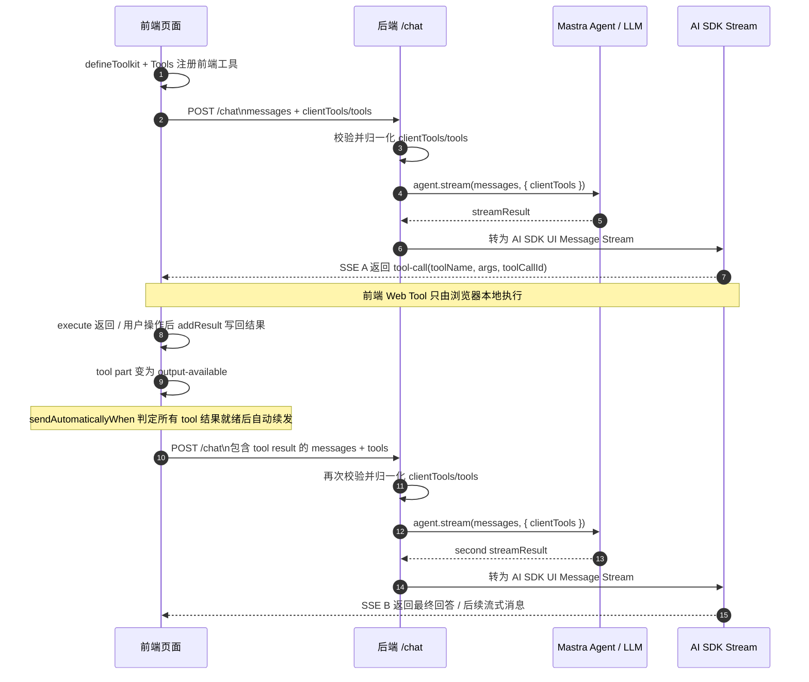

## 1. 方案定位

这份文档描述的是 **Mastra 后端 + assistant-ui 前端** 组合下的前端 Web Tool 调用流程。

- 后端方案：Mastra Agent，通过 `clientTools` 接收“由客户端执行的工具声明”。
- 前端方案：assistant-ui，通过 `defineToolkit` 定义 Web Tool，并用 AI SDK runtime 处理 tool-call、tool result 写回和自动续发。
- 通信方式：前端请求 `/chat`，服务端调用 `agent.stream(messages, { clientTools })`，再通过 AI SDK UI Message Stream 把 tool-call 和后续回答返回前端。

## 2. 一句话结论

Mastra + assistant-ui 的前端 Web Tool 核心流程是：

> 前端声明“当前浏览器环境有哪些可用工具”，服务端把这些声明作为 Mastra `clientTools` 注入 `agent.stream()`；模型在生成过程中决定调用工具；tool-call 通过流式响应回到前端；前端执行本地工具后，把 tool result 合入 messages，再次请求 `/chat`；Mastra Agent 基于工具结果继续生成。

在 assistant-ui / AI SDK 范式下，续发通常不需要业务代码手写：

> 前端执行本地工具并把结果写回 messages 后，由 AI SDK 的 `sendAutomaticallyWhen`（`lastAssistantMessageIsCompleteWithToolCalls`）自动再次请求 `/chat` 继续生成。

注意：

- 不是后端主动发现前端有哪些工具。
- 不是后端把工具列表下发给前端执行。
- 不是前端把 `execute` 函数发给后端。
- 真正执行浏览器动作的一定是前端。

## 3. 核心角色

| 角色 | 职责 |
| --- | --- |
| 前端页面 | 定义本地 Web Tool executor，例如打开页面、读取 localStorage、操作 DOM |
| 前端请求 | 在 `/chat` 请求中携带 `clientTools` 或兼容字段 `tools`，告诉后端当前环境有哪些工具 |
| assistant-ui Toolkit | 通过 `defineToolkit` 组织工具 schema、前端 `execute`、工具 UI |
| 服务端 `/chat` 接口 | 接收请求、校验工具声明、调用 Mastra Agent、写回 SSE 响应 |
| Mastra `clientTools` | Mastra Agent 执行选项中用于描述客户端工具的字段 |
| Mastra Agent / LLM | 根据用户输入和工具 schema，决定是否发起 tool-call |
| AI SDK UI Message Stream | 把 Mastra tool-call、后续回答等事件流式返回给前端 |
| assistant-ui / AI SDK Runtime | 执行本地工具、写回工具结果，并在结果就绪后自动续发 |
| 第二次 `/chat` | 携带包含 tool result 的 messages，驱动 Mastra Agent 继续生成 |

## 4. 总体流程图

### 4.1 Flowchart



### 4.2 Sequence Diagram



### 4.3 文本版本

```text
前端页面启动
  ↓
通过 assistant-ui defineToolkit 定义前端工具
  ↓
用户发送消息
  ↓
前端 POST /chat
请求体携带 messages + clientTools/tools 声明
  ↓
后端校验工具名、schema、description
  ↓
后端转换为 Mastra clientTools
  ↓
agent.stream(messages, { clientTools })
  ↓
/chat 返回第一条 SSE，即 SSE A
  ↓
LLM 判断需要调用某个 client tool
  ↓
后端通过 AI SDK UI Message Stream 返回 tool-call
  ↓
前端收到 tool-call，根据 toolName 找到本地工具
  ↓
execute 返回结果 / 用户操作后调用 addResult 写回结果
  ↓
tool part 变为 output-available
  ↓
sendAutomaticallyWhen（lastAssistantMessageIsCompleteWithToolCalls）判定结果就绪
  ↓
AI SDK 自动再次 POST /chat
携带包含 tool result 的完整 messages + tools
  ↓
后端 agent.stream(...)
  ↓
第二次 /chat 返回第二条 SSE，即 SSE B
  ↓
Mastra Agent 读取工具结果后继续生成
  ↓
前端继续消费最终回答
```

## 5. 定义前端工具

前端可以使用 assistant-ui 的 `defineToolkit` 把工具的模型契约、执行逻辑和工具 UI 放在同一个 toolkit 里。

### 5.1 即时型工具

即时型工具适合不需要用户交互、可立即返回结果的场景，例如读取当前登录用户信息。

```tsx
import React from 'react';
import { type ToolDefinition } from '@assistant-ui/react';
import { z } from 'zod';

export const GET_USER_INFO_TOOL_NAME = 'get-user-info-tool';

const getUserInfoToolSchema = z.object({});

export const useGetUserInfoToolDefinition = (): ToolDefinition => {
  const user = useCurrentUser();

  return React.useMemo(
    () => ({
      type: 'frontend',
      description: '当用户要求查看当前登录用户信息时调用，返回用户名、邮箱、部门等。',
      parameters: getUserInfoToolSchema,
      execute: async () => ({
        success: Boolean(user),
        user,
        message: user ? '已获取当前用户信息' : '当前用户信息暂未加载完成',
      }),
      render: ({ result }) => <UserInfoCard user={result?.user ?? user} />,
    }),
    [user]
  );
};
```

要点：

- `type: 'frontend'` 表示这是前端可执行工具。
- `defineToolkit({ ... })` 聚合时的 key 就是工具名。
- `description` 和 `parameters` 是给模型看的工具契约。
- `execute` 是前端工具执行逻辑，运行在浏览器侧。
- `render` 用于展示工具调用状态和结果。
- `execute` 只存在于前端构建产物和浏览器环境里，后端不会收到这个函数。

### 5.2 人在回路型工具

人在回路型工具适合必须等待用户确认或用户手势的场景，例如打开新窗口、提交表单、确认高风险操作。

```tsx
import { z } from 'zod';

export const JUMP_URL_TOOL_NAME = 'jump-url-tool';

const jumpUrlToolSchema = z.object({
  url: z.string().describe('需要打开的完整 URL'),
});

export const jumpUrlTool = {
  type: 'frontend',
  description: '展示确认卡片，用户点击确认后在新窗口打开 URL。',
  parameters: jumpUrlToolSchema,
  render: ({ args, result, addResult }) => {
    const targetUrl = result?.url ?? normalizeUrl(args.url);
    const done = Boolean(result?.success);

    const handleConfirm = () => {
      window.open(targetUrl, '_blank', 'noopener,noreferrer');
      addResult?.({
        success: true,
        url: targetUrl,
        message: `已打开：${targetUrl}`,
      });
    };

    return <JumpUrlCard url={targetUrl} done={done} onConfirm={handleConfirm} />;
  },
};
```

这类工具通常不提供 `execute`，而是在用户操作后通过 `addResult` 写回结果。这样可以避免浏览器因为缺少用户手势而拦截 `window.open` 等行为。

### 5.3 聚合工具

```ts
import React from 'react';
import { defineToolkit, type Toolkit } from '@assistant-ui/react';

export const useAgentToolkit = (): Toolkit => {
  const getUserInfoTool = useGetUserInfoToolDefinition();
  const jumpUrlTool = useJumpUrlToolDefinition();

  return React.useMemo(
    () =>
      defineToolkit({
        [GET_USER_INFO_TOOL_NAME]: getUserInfoTool,
        [JUMP_URL_TOOL_NAME]: jumpUrlTool,
      }),
    [getUserInfoTool, jumpUrlTool]
  );
};
```

## 6. 注册 Runtime 并开启自动续发

使用 assistant-ui 和 AI SDK 时，可以在 runtime 中配置 `sendAutomaticallyWhen`。工具结果写回 messages 后，AI SDK 会自动再次请求 `/chat`，让模型基于工具结果继续生成。

```tsx
'use client';

import React from 'react';
import { AssistantRuntimeProvider, Tools, useAui } from '@assistant-ui/react';
import { useChatRuntime } from '@assistant-ui/react-ai-sdk';
import { lastAssistantMessageIsCompleteWithToolCalls } from 'ai';

export function AssistantProvider({ children }: { children: React.ReactNode }) {
  const toolkit = useAgentToolkit();

  const runtime = useChatRuntime({
    api: '/chat',
    sendAutomaticallyWhen: lastAssistantMessageIsCompleteWithToolCalls,
  });

  const aui = useAui({
    tools: Tools({ toolkit }),
  });

  return (
    <AssistantRuntimeProvider aui={aui} runtime={runtime}>
      {children}
    </AssistantRuntimeProvider>
  );
}
```

`sendAutomaticallyWhen: lastAssistantMessageIsCompleteWithToolCalls` 是关键配置。没有它，前端执行完工具后可能停在 tool-call 状态，对话不会继续。

## 7. 请求体协议

前端首次请求 `/chat` 时，需要把当前可用工具声明一起带上。

推荐使用 `clientTools`：

```json
{
  "messages": [
    {
      "role": "user",
      "content": "帮我打开 https://example.com"
    }
  ],
  "clientTools": {
    "jump-url-tool": {
      "description": "当用户要求打开/跳转某个 URL 时调用，在新窗口打开。",
      "inputSchema": {
        "type": "object",
        "properties": {
          "url": {
            "type": "string",
            "description": "需要打开的完整 URL"
          }
        },
        "required": ["url"]
      }
    }
  }
}
```

如果前端使用 assistant-ui / AI SDK，也可能发送兼容字段 `tools`：

```json
{
  "messages": [
    {
      "role": "user",
      "content": "帮我打开 https://example.com"
    }
  ],
  "tools": {
    "jump-url-tool": {
      "description": "当用户要求打开/跳转某个 URL 时调用，在新窗口打开。",
      "parameters": {
        "type": "object",
        "properties": {
          "url": {
            "type": "string"
          }
        },
        "required": ["url"]
      }
    }
  }
}
```

协议规则：

- 推荐使用 `clientTools`。
- `tools` 可以作为 assistant-ui / AI SDK 的兼容 alias。
- `clientTools` 和 `tools` 不应同时传。
- `tools.parameters` 可以归一化成 `clientTools.inputSchema`。
- 请求体不能传 `execute`。
- 后端只接收 JSON 可序列化的工具声明，不接收函数或运行时代码。

## 8. 服务端归一化为 Mastra clientTools

服务端收到前端工具声明后，应转换为 Mastra Agent 执行时可识别的 `clientTools`。

概念上等价于：

```ts
agent.stream(messages, {
  clientTools: {
    'jump-url-tool': {
      description: '当用户要求打开/跳转某个 URL 时调用，在新窗口打开。',
      parameters: jsonSchema({
        type: 'object',
        properties: {
          url: { type: 'string' },
        },
        required: ['url'],
      }),
    },
  },
});
```

注意这里是 `clientTools`，不是服务端工具集合。

原因：

- `clientTools` 是 Mastra Agent 执行选项中表示客户端工具声明的字段。
- `tools` 在不同生态里含义不同，直接透传容易和服务端工具混淆。
- 前端工具不是服务端工具，后端不执行它。

服务端建议做以下校验：

- 工具名只允许安全字符和合理长度。
- `description` 必须是字符串，并限制最大长度。
- `inputSchema` / `parameters` 必须是 JSON Schema 对象。
- schema 需要限制深度、字段数量和整体体积。
- descriptor 中出现 `execute`、函数或非 JSON 可序列化内容时直接拒绝。
- `clientTools` 与 `tools` 同时存在时直接拒绝。

## 9. 模型产生 tool-call

模型会看到类似这样的工具契约：

```text
工具名：jump-url-tool
描述：当用户要求打开/跳转某个 URL 时调用，在新窗口打开
参数：
  - url: string
```

当用户说：

```text
帮我打开 https://example.com
```

模型可能产生 tool-call：

```json
{
  "toolName": "jump-url-tool",
  "toolCallId": "call_xxx",
  "args": {
    "url": "https://example.com"
  }
}
```

这个 tool-call 会进入流式响应，并返回给前端 runtime。

## 10. 前端执行工具并写回结果

前端收到 tool-call 后，根据 `toolName` 找到本地工具。

工具结果有两种写回方式，两者都会把结果合入当前 assistant 消息的 tool part，使其状态变为 `output-available`。

### 10.1 直接 execute

适合不需要用户交互、可立即返回结果的工具。

```ts
{
  type: 'frontend',
  description: '返回当前登录用户信息',
  parameters: z.object({}),
  execute: async () => ({
    success: true,
    user,
    message: '已获取当前用户信息',
  }),
  render: ({ result }) => <UserInfoCard user={result?.user} />,
}
```

### 10.2 通过 addResult 写回

适合需要用户确认、用户手势或异步业务操作的工具。

```ts
{
  type: 'frontend',
  description: '展示确认卡片，用户点击确认后打开 URL',
  parameters: jumpUrlToolSchema,
  render: ({ args, result, addResult }) => {
    const targetUrl = result?.url ?? normalizeUrl(args.url);
    const done = Boolean(result?.success);

    const handleConfirm = () => {
      window.open(targetUrl, '_blank', 'noopener,noreferrer');
      addResult?.({ success: true, url: targetUrl });
    };

    return <JumpUrlCard url={targetUrl} done={done} onConfirm={handleConfirm} />;
  },
}
```

关键区别：

- `execute` 型工具会立即满足续发条件。
- `addResult` 型工具在用户完成操作前保持未完成态，不会自动续发。

## 11. 工具结果就绪后续发

普通 assistant-ui Web Tool 执行完后，续发由 AI SDK 的 `sendAutomaticallyWhen` 机制自动触发。

```ts
import { useChat } from '@ai-sdk/react';
import { lastAssistantMessageIsCompleteWithToolCalls } from 'ai';

const chat = useChat({
  id,
  transport,
  sendAutomaticallyWhen: lastAssistantMessageIsCompleteWithToolCalls,
});
```

机制说明：

- `lastAssistantMessageIsCompleteWithToolCalls` 是 `ai` 包提供的判定函数。
- 当最后一条 assistant 消息的所有 tool part 都进入 `output-available` 时返回 `true`。
- 此时 AI SDK 自动发起下一次 `/chat`。
- 续发请求体里携带包含 tool result 的完整 messages。
- `execute` 一返回，或 `addResult` 一调用，续发条件就可能满足。

续发请求也应携带工具声明。首次请求和续发请求都携带工具声明，可以保证 Agent 在后续生成中仍能理解可用的 client tools。

## 12. 成功场景示例

以 `jump-url-tool` 为例。

### 用户输入

```text
帮我打开 https://example.com
```

### 首次请求

```json
{
  "messages": [
    {
      "role": "user",
      "content": "帮我打开 https://example.com"
    }
  ],
  "tools": {
    "jump-url-tool": {
      "description": "当用户要求打开/跳转某个 URL 时调用，展示确认卡片，用户点击确认后在新窗口打开。",
      "parameters": {
        "type": "object",
        "properties": {
          "url": {
            "type": "string"
          }
        },
        "required": ["url"]
      }
    }
  }
}
```

### 模型产生 tool-call

```json
{
  "toolName": "jump-url-tool",
  "toolCallId": "call_xxx",
  "args": {
    "url": "https://example.com"
  }
}
```

### 前端执行

```ts
const handleConfirm = () => {
  window.open(targetUrl, '_blank', 'noopener,noreferrer');
  addResult?.({
    success: true,
    url: targetUrl,
    message: `已打开：${targetUrl}`,
  });
};
```

`addResult` 把结果写回后，tool part 变为 `output-available`，满足 `lastAssistantMessageIsCompleteWithToolCalls`，AI SDK 自动发起续发请求。

### 自动续发请求

```json
{
  "messages": [
    {
      "role": "user",
      "content": "帮我打开 https://example.com"
    },
    {
      "role": "assistant",
      "parts": [
        {
          "type": "tool-call",
          "toolCallId": "call_xxx",
          "toolName": "jump-url-tool",
          "args": {
            "url": "https://example.com"
          }
        }
      ]
    },
    {
      "role": "tool",
      "parts": [
        {
          "type": "tool-result",
          "toolCallId": "call_xxx",
          "toolName": "jump-url-tool",
          "result": {
            "success": true,
            "url": "https://example.com",
            "message": "已打开：https://example.com"
          }
        }
      ]
    }
  ],
  "tools": {
    "jump-url-tool": {
      "description": "当用户要求打开/跳转某个 URL 时调用，展示确认卡片，用户点击确认后在新窗口打开。",
      "parameters": {
        "type": "object",
        "properties": {
          "url": {
            "type": "string"
          }
        },
        "required": ["url"]
      }
    }
  }
}
```

### Mastra Agent 继续输出

```text
已为你打开 https://example.com。
```

## 13. 异常场景

### 同时传 `clientTools` 和 `tools`

返回 400：

```json
{
  "message": "clientTools and tools cannot be provided at the same time"
}
```

### 工具名非法

例如：

```json
{
  "clientTools": {
    "../evil": {
      "description": "bad"
    }
  }
}
```

应返回 400。

### 传入 `execute`

例如：

```json
{
  "clientTools": {
    "jump-url-tool": {
      "description": "打开 URL",
      "execute": "function..."
    }
  }
}
```

应返回 400。

### schema 不是对象

例如：

```json
{
  "clientTools": {
    "jump-url-tool": {
      "description": "打开 URL",
      "inputSchema": "not-object"
    }
  }
}
```

应返回 400。

## 14. 和 assistant-ui defineToolkit 的关系

assistant-ui `defineToolkit` 通常把三类信息组织在一起：

- 模型可见的 schema；
- 前端执行的 `execute`；
- tool-call UI 渲染。

后端只应接收其中的 schema / description 部分。

对应关系：

```text
assistant-ui defineToolkit
  -> 前端 runtime 请求时带 tools
  -> 后端把 tools 当作兼容字段读取
  -> parameters/schema/inputSchema 归一化
  -> Mastra clientTools
  -> tool-call stream 返回前端
  -> 前端执行 execute / 用户操作后 addResult 写回结果
  -> sendAutomaticallyWhen 自动续发 /chat
  -> Mastra Agent 基于工具结果继续生成
```

## 15. 实现检查清单

前端侧：

- 使用 `defineToolkit` / `Tools({ toolkit })` / `useAui({ tools })` 注册工具。
- 只把 `type === 'frontend'` 的工具声明上送给后端。
- `useChat` 或等价 runtime 配置 `sendAutomaticallyWhen: lastAssistantMessageIsCompleteWithToolCalls`。
- 即时型工具用 `execute` 返回结果。
- 人在回路型工具用 `render` 的 `addResult` 在用户操作后写回结果。
- 首次请求和续发请求都携带工具声明。

服务端侧：

- `/chat` 接收 `clientTools`。
- 兼容 assistant-ui / AI SDK 的 `tools` 字段。
- 校验工具名、schema、description、工具数量和 schema 体积。
- 拒绝 `execute` 和非 JSON 可序列化内容。
- 将前端工具声明注入 Mastra Agent 执行选项的 `clientTools`。
- 继续通过 AI SDK UI Message Stream 输出 tool-call 和后续回答。
